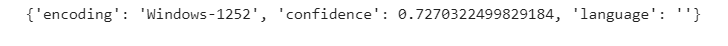
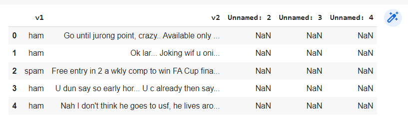
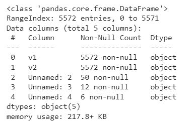
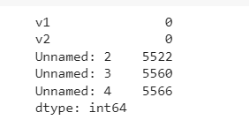
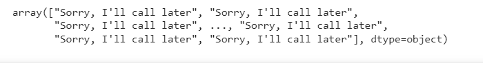
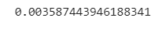

# Implementation-of-SVM-For-Spam-Mail-Detection

## AIM:
To write a program to implement the SVM For Spam Mail Detection.

## Equipments Required:
1. Hardware – PCs
2. Anaconda – Python 3.7 Installation / Jupyter notebook

## Algorithm
1. Start the program
2. Import the python pandas library as pd
3. Read the contents of the Spam csv file
4. Display the first 5 rows of the dataset using head()
5. Assign x as v1 values and y as v2 values
6. From sklearn library select the feature extraction and import CountVectorizer
7. CountVectorizer will convert the Text to Numerical Data
8. From sklearn library import Support Vector Classifier (ie. SVC)
9. Predict the x_test using SVC
10. Print the accuracy of the SVM Model 11.Stop the program 

## Program:
```python
Program to implement the SVM For Spam Mail Detection..
Developed by: KULASEKARAPANDIAN K
RegisterNumber: 212222240052
```

```python
import chardet
file='/content/spam.csv'
with open(file, 'rb') as rawdata:
  result = chardet.detect(rawdata.read(100000))
result

import pandas as pd
data=pd.read_csv("/content/spam.csv",encoding = 'Windows-1252')

data.head()

data.info()

data.isnull().sum()

x=data["v1"].values

y=data["v2"].values

from sklearn.model_selection import train_test_split
x_train,x_test,y_train,y_test=train_test_split(x,y,test_size=0.2,random_state=0)

from sklearn.feature_extraction.text import CountVectorizer
cv = CountVectorizer()

x_train=cv.fit_transform(x_train)
x_test=cv.transform(x_test)

from sklearn.svm import SVC
svc=SVC()
svc.fit(x_train,y_train)
y_pred=svc.predict(x_test)
y_pred

from sklearn import metrics
accuracy=metrics.accuracy_score(y_test,y_pred)
accuracy
```

## Output:

#### RESULT:



#### HEAD VALUES:


#### DATA INFO:


#### NULL:


#### PREDICTION VALUE:


#### ACCURACY VALUE:



## Result:
Thus the program to implement the SVM For Spam Mail Detection is written and verified using python programming.
